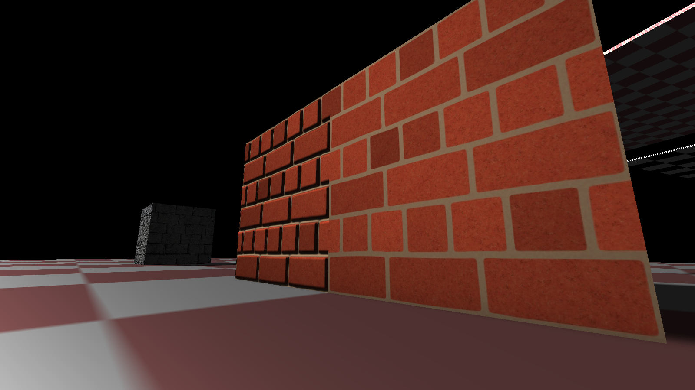
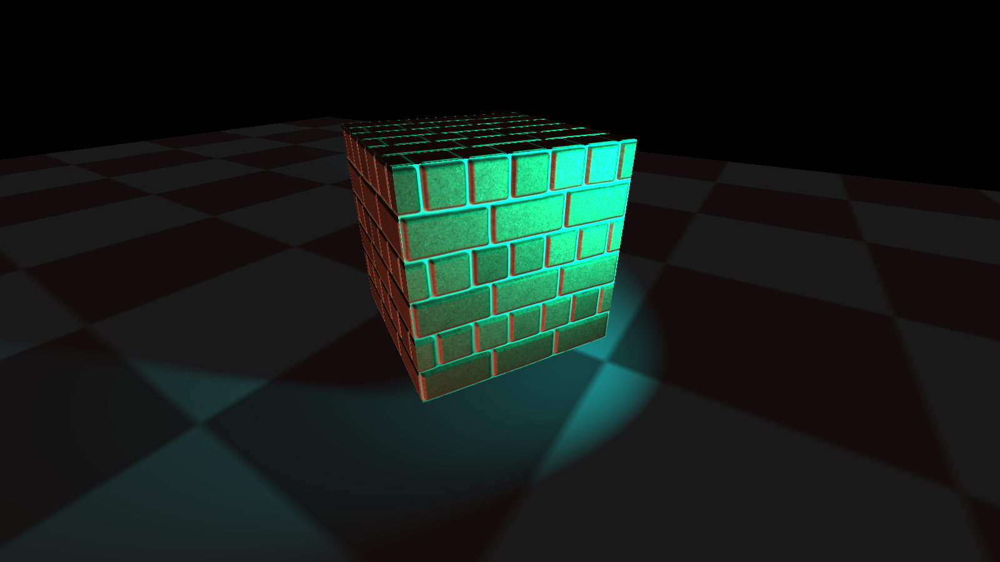
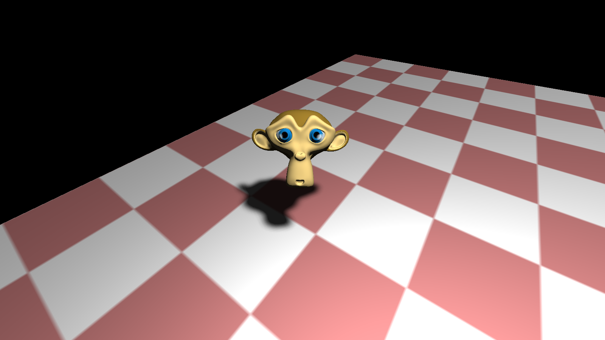

# 3D Game Engine

This project is an attempt to create a simple 3D Game Engine for learning purposes. My goal is to gain an understanding on how to render in real time 3D object with different light effects. 

## Presentation

The project supports the creation of simple scene made of loaded 3D objects that can be animated. 

We can apply materials to these objects. Materials are made of textures and support normal mapping and displacement mapping for an enhanced 3D effect. See example of material with normal map and displacement map:

The engine support various type of light such as directional, point and spot. See example of spot light:

The engine support simple shadow maps. See example of shadow:

Quick demonstration:  

## Dependencies
- [Java](https://www.java.com/en/download/)
- [LWJGL](https://www.lwjgl.org/)
- [IntelliJ IDEA](https://www.jetbrains.com/idea/) was used for this project but any IDE can be used

## Build instructions

- Create a new project in your IDE
- Import files under the "src" directory as source files
- Import files under the "jar" directory as library files
- Copy the "res" directory in your project folder
- Build and run
